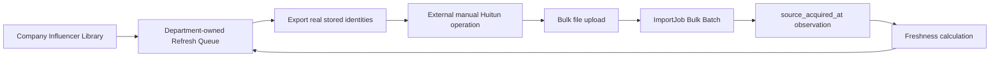

# 技术架构

## 0. 权威边界

- Phase 1A–1C 的实际实现以 `packages/backend_core`、FastAPI/Worker 薄入口、`0001`–`0003_phase1b` migrations 和已通过测试为准。
- Phase 2 的冻结目标以 `docs/PHASE_2_SCOPE.md` 为唯一详细设计；本文件只记录系统级架构边界。
- 当前开发分支已经落地 Task 1–7；Task 7 只增加从 confirmed lineage 推导的 Freshness Domain 和现有 Influencer GET 的 additive 字段/筛选，不授权或提前实现 Refresh Queue、Refresh Return 或 Web。
- 旧的 Browser Automation 方案已废弃。当前 Phase 2 不包含灰豚登录、页面自动化或自动采集器。
- 唯一共享 Python 业务核心是 `packages/backend_core`。`apps/api` 只负责 HTTP，`apps/worker` 只负责异步任务入口；禁止 API 内 Service、根目录 `services/` 或第二套 Matcher/Merge。

---

## 1. 当前七服务架构

```text
Browser
  ↓
Nginx
  ├─ Next.js Web
  └─ FastAPI HTTP Layer
        ↓
packages/backend_core
  ├─ PostgreSQL
  ├─ Redis
  ├─ /data/imports
  └─ Provider Adapters

Celery Worker / Scheduler
        ↓
packages/backend_core
```

Docker Compose 服务保持不变：

```text
nginx
web
api
worker
scheduler
postgres
redis
```

Phase 2 不增加新服务。PostgreSQL 与 Redis 继续只在 Docker 内部网络可见。

---

## 2. Phase 2 Bulk Import 数据流

```mermaid
flowchart LR
    U["User uploads files"] --> J["ImportJob = Bulk Batch"]
    J --> F["ImportJobFile occurrences"]
    F --> S["StoredImportFile blobs"]
    F --> P["Per-file parse and mapping"]
    P --> IR["ImportRows with file lineage"]
    IR --> A["Existing Source Adapters"]
    A --> C["Canonical records"]
    C --> M["UnifiedPlanBuilder + frozen Matcher/Planner"]
    M --> V["Unified persisted Preview Revision + row plan hash"]
    V --> H["Human Confirm"]
    H --> Q["Durable confirm task request"]
    Q --> RV["Rebuild and compare the complete plan"]
    RV --> T["One PostgreSQL business transaction"]
    T --> I["ImportMergeApplier + frozen Phase 1B semantics"]
```



核心不变量：

- 一个 `ImportJob` 就是一个多文件 Bulk Batch；不新增 `ImportBatch` 或 `BatchRow`。
- 每个文件通过 `ImportJobFile` 保留 occurrence、Mapping、SHA-256、`source_acquired_at` 与行级 lineage。
- 同一 Batch 的所有文件经过同一个 Canonical Contract、Matcher、Planner、Preview Revision 和 Confirm Transaction。
- Preview 与 Confirm 共用唯一 `UnifiedPlanBuilder`；Preview 使用 replace-staging 模式，Confirm 使用 non-pruning revalidation 模式，避免重算时删除用户已看到并被 revision 绑定的持久 Row。
- Legacy 与 Bulk Confirm 共用唯一 `ImportMergeApplier` 实现 Phase 1B Merge；Bulk 只负责预取、稳定锁、分阶段 flush 和事务编排，不建立第二套 Matcher/Merge。
- Preview 不写达人业务表；MVP 没有 auto-confirm。
- 文件内、跨文件和数据库三层去重都复用 Phase 1B 的硬身份规则；Email 只产生疑似重复。
- Phase 1B 的新鲜度合并、人工数据保护、Contact 和不可变 Metric Snapshot 语义不变。

---

## 3. Phase 2 Freshness 与 Refresh 回流



- Freshness 粒度为 `PlatformAccount + Source`，不以 Influencer 汇总掩盖 stale account。
- `source_acquired_at` 表示文件实际从来源取得的大致时间；新 Bulk Draft 上传默认服务器接受时间，可在首次 Preview 前修改，之后冻结。Legacy 单文件兼容路径保持 unknown。
- Legacy 数据没有可靠 acquisition time 时保持 unknown；`committed_at` 只能支持 `last_huitun_imported_at`，不能冒充 observed time。
- Refresh Queue 由 Department 拥有，但候选来源是公司级 Influencer Library；Owner 与导入部门不是读取 ACL。
- Queue CSV 只导出真实 Identity。在真实灰豚产品流程验证前，不承诺灰豚能直接批量消费这些 Identity。

---

## 4. 模块边界

### auth

部门登录、Session、Department Permission 和 Operator Audit 归属。

### imports

文件存储、安全解析、Mapping、Canonical Adaptation、三层去重、统一 Preview、Confirm、来源 lineage 和 Bulk Batch。

### influencers

公司级 Influencer、PlatformAccount、Source State/Identity、Contact、Current Metrics、Metric Snapshot 与只读资源库查询。

### imports / CollectionJob

CollectionJob 继续位于现有 `backend_core.imports` 域，并增加 versioned structured screening rules。Phase 2 MVP 只做 platform、Source Tag exact 和 Followers 范围的确定性三态判断，不为它新建重复业务域。

### freshness / refresh

Freshness 计算、Department-owned Refresh Queue、Queue Item、真实 Identity 导出与 Import 回流核销。实现位置仍在 `backend_core`，不建立独立服务。

### campaigns / playbooks / ai / email / inbox / crm / analytics

保留为后续阶段模块边界。当前 Phase 2 不实现这些能力。

---

## 5. 数据源适配器

通用输入必须转换为平台无关 Canonical Contract：

```python
class SourceAdapter:
    def mapping_for_headers(self, headers): ...
    def adapt(self, raw_record): ...
```

已实现：

- `HuitunCsvAdapter`
- `HuitunExcelAdapter`
- `GenericCsvAdapter`

Phase 2 Bulk Batch 逐文件选择 Adapter，但通用 Planner/Matcher/Repository 不得出现灰豚专用分支。抖音、视频号及其他 Connector 均不在 MVP 范围。

---

## 6. Worker、并发与恢复

- 仍使用现有 Celery Worker 与 Scheduler，不增加服务。
- 当前 4C/8GB 测试服务器的 Worker concurrency 固定为 `2`。
- Heavy Import Preview/Confirm 全局同时最多运行 `1` 个；同一 PostgreSQL advisory-lock key family 先序列化 heavy execution，再进行 task claim，锁竞争不消耗持久 run attempt。session 退出会释放锁，不能只依赖进程内 semaphore 或 Redis 锁。
- 任务入口只解析参数、装配 Session 并调用 `backend_core`；不得复制业务逻辑。
- `import_task_requests` 持久化 task token、kind、target、state、dispatch/run attempts、retry time 与 Worker lease；PostgreSQL 是唯一恢复事实源和 lease wall-clock，Celery/Redis 只提供 at-least-once delivery。
- API 将业务状态、task request 和首次 dispatch reservation 同事务提交，提交后才发布 ID-only Broker message；发布失败保留到期 reservation，由 Scheduler 恢复，不向内存或 Audit 写第二套 outbox 状态。
- Worker 使用 token/kind/Job/File/revision 精确 claim；claim 在执行前单独提交，持久增加 `run_attempts`、分配 generation 并设置 lease。Heartbeat 使用独立线程、事件循环和数据库连接，避免同步文件读取/解析饿死续租；heartbeat/complete 都先锁 task row，再读取 PostgreSQL `clock_timestamp()` 校验当前 generation 与 lease。旧 Worker、旧 generation 或租约丢失后不得完成 task。
- Confirm 成功时，达人业务写入、Row committed lineage、Job result/completed、task completed 和成功 Audit 在同一事务提交。提交结果不确定时先按 token 查询 PostgreSQL；completed 优先于重复执行。
- 确定性业务错误进入 `terminal_failed`；瞬时错误进入 `retry_wait`。Dispatch/run attempts、指数退避上限和 exhaustion 都由 PostgreSQL/Settings 决定，不能使用 Celery retry metadata 作为 authoritative count。
- Scheduler 只负责 bounded、deterministic 的持久化任务 reconciliation；使用 `FOR UPDATE SKIP LOCKED` 领取到期 requested/retry_wait 或 lease 过期 running task，并在发布 Broker 前提交 reservation。多 Scheduler 不会重复领取同一行；发布失败等待下一次持久重试。
- Cancel 只将尚未运行的 requested/retry_wait task 与 Job 同事务取消；running task 返回 409，不尝试远程杀死已开始的数据库事务。

---

## 7. 数据库与 Migration 边界

- 当前开发分支 Alembic head 为 `0004_phase2_bulk_import`；正式服务器仍停留在 `0003_phase1b`，Task 7 不执行部署。
- `0004_phase2_bulk_import` 已包含 Bulk Import、durable `import_task_requests` 与 frozen Freshness 查询索引；Task 7 不创建 Migration。`0005_phase2_refresh_queue` 仍只保留给 Task 8，当前不存在且不得由 Task 7 创建。
- 仍被 `ImportJobFile` lineage 引用的 `StoredImportFile` 不得被 cleaner 物理删除；`expires_at` 不是删除授权。
- 含真实多文件或 Queue 数据时，破坏性 downgrade 必须安全拒绝并给出原因，不能静默丢失 lineage。

---

## 8. 幂等性与数据安全

必须幂等：

- 同 Job 相同 SHA 的文件上传。
- 文件 Parse/Retry。
- Preview Revision 生成。
- Confirm 与 Worker Retry。
- Refresh Queue Item fulfillment。

必须使用：

- 数据库唯一约束和稳定幂等键。
- Preview Revision、Plan Hash 与相关状态再校验。
- PostgreSQL transaction/row lock。
- Heavy Import 分布式 lease（必要时）。

不得使用：

- Email 自动匹配或合并。
- filename/mtime 推断 acquisition time。
- free-text 或 AI 推断 Screening。
- 将旧 Preview、旧 committed_at 或 Influencer.updated_at 伪装成新的来源观察。

---

## 9. 可观测性

结构化日志与 Audit 至少覆盖：

- Batch/File/Row 标识、状态迁移和稳定错误码。
- Preview Revision、Confirm 结果与 Worker Retry。
- Queue 创建、导出与核销结果。
- API/Worker/Import/Login 失败。

禁止记录密码、Session/Auth/Access Token、Secret、完整 Contact 或原始敏感行。日志字段只能使用白名单摘要和实体 ID；persisted import task token 只可作为 Task 6 的必要 task identity 白名单字段。

---

## 10. 性能门禁

- 2000 行：Parse、Normalize、Dedup、Preview、Confirm 必须稳定且没有逐行 N+1，是 MVP 发布 blocker。
- 5000 行：capacity gate 与性能观察。
- 10000 行：correctness/no-OOM soak；耗时不作为 MVP 发布 blocker。
- 优化应优先采用 batch preload、in-memory batch index 和批量写入，不能为极端规模复制 Matcher 或改变 Phase 1B Merge 语义。

详细验收与任务切片见 `docs/PHASE_2_SCOPE.md`。
